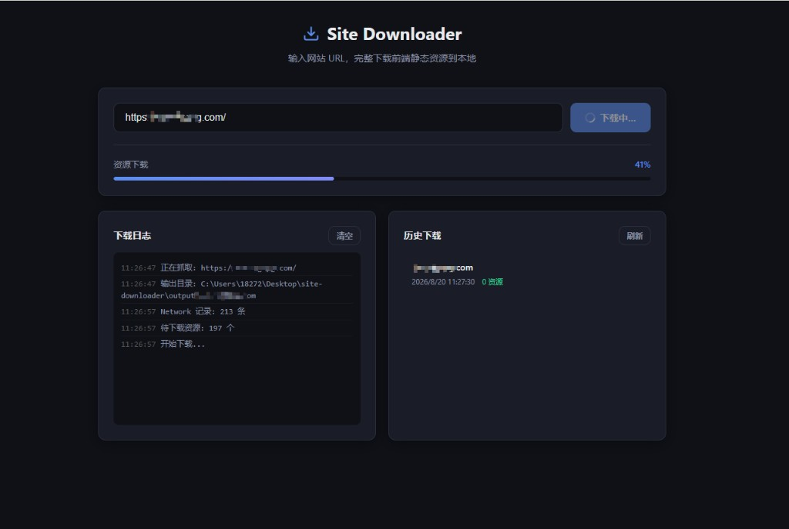

# site-downloader

独立网站前端资源下载工具。通过 Playwright 监听浏览器实际加载的资源，完整下载到本地并改写为相对路径。

## 界面预览



## 环境要求

- Node.js >= 14（推荐 >= 16）
- 首次使用需安装 Playwright Chromium

## 安装

```bash
cd C:\Users\18272\Desktop\site-downloader
npm install
npx playwright install chromium
```

## 使用

```bash
npm start
```

浏览器打开终端显示的地址（默认 **http://localhost:3000**，若端口被占用会自动递增）：

1. 输入目标网站 URL
2. 点击「开始下载」
3. 等待进度完成
4. 点击「本地预览」查看下载结果

也可单独启动预览服务（命令行）：

```bash
npm run serve -- output/example.com
```

## 输出结构

```
output/example.com/
├── index.html          # Playwright 渲染后的 DOM
├── manifest.json       # 资源清单
├── network.json        # 全部 network 请求（含 API）
├── report.json         # 下载统计
├── errors.json         # 失败资源（如有）
└── ...                 # 按原站路径保存的资源文件
```

## 测试

1. 运行 `npm start`
2. 在界面输入 `https://example.com` 并下载
3. 点击「本地预览」，检查页面、CSS、图片、字体是否正常
4. 查看 `output/example.com/report.json` 了解成功/失败统计

## 模块说明

| 文件 | 职责 |
|------|------|
| `server.js` | Web 界面 + API 入口 |
| `serve.js` | 独立本地静态预览服务 |
| `src/crawler.js` | 主流程编排 |
| `src/job-manager.js` | 下载任务管理 |
| `src/preview-server.js` | 预览服务 |
| `src/network.js` | Playwright 渲染 + network 监听 |
| `src/downloader.js` | 资源 HTTP 下载 |
| `src/resource-parser.js` | HTML/CSS/JS 资源发现 |
| `src/path-rewriter.js` | 本地相对路径改写 |
| `src/dedupe.js` | URL + 内容 hash 去重 |
| `src/reporter.js` | manifest / report 生成 |
| `public/` | Web 界面 |
